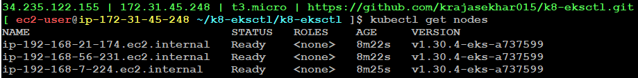

**What is Orchestration?** <br>
If suppose one person has 100 PGs --> He need a person to manage all at a time 
- One host is not enough to manage 1000s of containers. So, for this we need a Orchestration tool
    - Kubernetes is the Orchestration tool 

**what is Kubernetes?** 
- Kubernetes is by nature highly available, fault tolerent, and self healing.
- It is a Orchestration platform 
- Running the multiple containers 
- Control plane/master connects to multiple instances or nodes 

**Work Flow of Kubernetes**


1. We develop dockerfiles in VS Code and pushing to github.
2. Here, workstation is nothing but an EC2 instance in AWS (Linux Server)
3. We are pulling dockerfiles from github to our workstation and build Docker Images
4. Push these docker images to docker hub
5. Nodes will directly pull these docker images from docker hub
   - To pull the images from dockerhub we need to give some instructions i.e., through kubernetes
6. `kubectl` is a command-line tool used to interact with Kubernetes clusters (kubernetes client command, like for SSH we have used ssh client and for mysql we used mysql command prompt)
7. `eksctl` is a command-line tool for managing Amazon Elastic Kubernetes Service (EKS) clusters. It simplifies the process of creating, updating, and managing Kubernetes clusters on AWS
8. We need authentication with AWS through AWS CLI and we will configure it by using `aws configure` 
9. Docker is an YAML File. Here, in kubernetes we develop manifest files in vscode and push it to github 
10. Pull manifest files from github to workstation

> we use `eksctl` for cluster creation and `kubectl` for communication 

**Setup & Installation**
1. Create an ec2-instance(instance_type = t3.micro) and make sure you have atleast 50GB storage
2. Assign more storage to /var by resizing the disk space 
3. Install `Docker` , `eksctl` and run `aws configure`
    - We already have the file to install docker
4. Install `kubectl`
    - Go to AWS official documentation 
    ```
    https://docs.aws.amazon.com/eks/latest/userguide/install-kubectl.html
    ```
    and download linux (amd64) file
    ```
    curl -O https://s3.us-west-2.amazonaws.com/amazon-eks/1.31.0/2024-09-12/bin/linux/amd64/kubectl
    ```
    - After downloading, make the `kubectl` binary executable using the following command
    ```
    chmod +x ./kubectl
    ```
    - To use `kubectl` from anywhere in the terminal, move `/kubectl` to `/usr/local/bin/` directory using the following command
    ```
    sudo mv ./kubectl /usr/local/bin/kubectl
    ```
    - After making it executable, verify that kubectl is working using the following command
    ```
    kubectl version --client` 
    ```
    or 
    ```
    kubectl version
    ```
5. Install `eksctl`
    - Go to EKS (AWS) official documentation 
    ```
    https://eksctl.io/installation/
    ``` 
    and use the following commands in sequence
    ```
    ARCH=amd64
    ```
    ```
    PLATFORM=$(uname -s)_$ARCH
    ```
    ```
    curl -sLO "https://github.com/eksctl-io/eksctl/releases/latest/download/eksctl_$PLATFORM.tar.gz"
    ```
    ```
    tar -xzf eksctl_$PLATFORM.tar.gz -C /tmp && rm eksctl_$PLATFORM.tar.gz
    ```
    ```
    sudo mv /tmp/eksctl /usr/local/bin
    ```
    ```
    eksctl version
    ``` 
6. Run `aws configure`

**Creating Cluster using eksctl** 
**sample syntax:**
```
apiVersion: eksctl.io/v1alpha5
kind: ClusterConfig

metadata:
  name: expense-1
  region: us-east-1

managedNodeGroups:
  - name: expense
    instanceType: m5.large
    desiredCapacity: 3
    spot: true 
```
> managedNodeGroups means AWS take cares everything

**eks config file with spot instances**
- AWS have huge data center. There may be unused capacity in data center 
- **spot instances:** 
There will be 90% discount for spot instances. When AWS requires capacity to ondemand clients, they will take back instances with 2 mins of notice
- When spot instance is true then we can reduce the practice cost

**Can I run spot instances in production?** <br>
A) No becoz AWS takes everything, only we can put spot instances in development and testing

- Create a cluster using the command
```
eksctl create cluster --config-file=eks.yaml
```
- It will create control plane and three nodes. Internally it will create a ClouFormation Stack

- To retrieve and display information about the nodes in your Kubernetes cluster, the command is
```
kubectl get nodes
```


- To delete cluster:
```
eksctl delete cluster --config-file=eks.yaml
```
or
```
eksctl delete cluster --region=us-east-1 --name=expense
```
